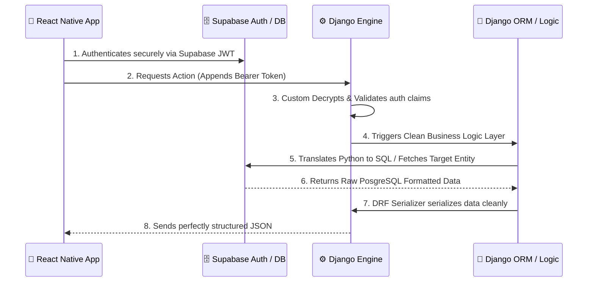

<div align="center">
  
  <h1>Social-Mate</h1>
  <p><em>An Instagram-inspired, modern social interaction platform built for learning, scale, and clean architecture.</em></p>
</div>

---

## 🎯 About The Project
Social-Mate is a comprehensive full-stack mobile application that mimics the foundational features of modern social media ecosystems like Instagram. The primary motivation underlying this platform wasn't just to build another social app, but to **deep-dive into the power of Django** and understand precisely how and why tech giants seamlessly scale their backend infrastructure.

## 🛠️ The Tech Stack
*   **Backend Strategy:** Python, Django REST Framework, Django ORM
*   **Database & Auth:** PostgreSQL + Supabase Authentication
*   **Frontend Ecosystem:** React Native (Expo), TypeScript
*   **DevOps & CI/CD:** GitHub Actions

---

## ✨ Features It Offers
*   **Secure Authentication:** Powered by Supabase, synchronized instantaneously with our Django User models.
*   **Dynamic Social Feeds:** Fully working chronological/algorithmic media feeds.
*   **User Interactions:** A robust Follow/Unfollow mechanism to build networks.
*   **Post Engagement:** Real-time Liking and Bookmark functionalities.
*   **Story Architecture:** Ephemeral storytelling mimicking mainstream social apps.

### 🔮 Future Roadmap
- [ ] End-to-end Encrypted Direct Messaging (WebSockets integration).
- [ ] AI-driven feed recommendations.
- [ ] Advanced video processing and Reels functionality.
- [ ] Comprehensive Admin Analytics Dashboard.

---

## 🐍 Why Django? (The 'Instagram' Blueprint)
The architectural heart of this project is **Django**. But why Django? 
Instagram notoriously scaled to over a billion users while actively leveraging thousands of instances running Python & Django. This project was orchestrated to understand exactly *how* that feels under the hood, and how to harness it effectively.

### 1. Batteries Included, Extensible by Design
Django isn't just a minimal router. By stepping into Django, we instantly gained a powerful ORM (Object-Relational Mapping). The ORM elegantly abstracts raw, injection-prone SQL strings into beautiful Python code, making database interactions fast, secure, and incredibly readable.

### 2. The Clean Architecture Philosophy
Our backend is meticulously divided into logical module "apps" (`users`, `posts`, `notifications`), aggressively enforcing **Clean Architecture** conventions. In this loosely coupled environment:
*   **Models** strictly handle data integrity, relationships, and schema state.
*   **Serializers** exclusively translate and format complex data into structured RESTful JSON.
*   **Views/ViewSets** act as the security bouncers and workflow managers, delegating business logic correctly.

### 3. Rapid Prototyping Without Sacrificing Security
Frameworks often force you to choose between coding speed or security. Django brings built-in defense mechanisms (CSRF arrays, XSS protection, Password Hashing algorithms). Combined with the Django REST Framework (DRF), we scaffolded scalable, production-grade CRUD endpoints in days rather than weeks—bridging the gap between a startup's need for speed and an enterprise's need for security.

---

## 🔄 User Workflow architecture
Here's a visual representation of how user actions traverse across our Clean Architecture safely:



---

## 📸 App Interfaces
Here is a complete look at the Social-Mate Mobile App interface, demonstrating everything from authentication to creating posts and managing your profile.

<table align="center">
  <tr>
    <td align="center">
      <b>Onboarding & Auth</b><br>
      
    </td>
    <td align="center">
      <b>Sign In / Sign Up</b><br>
      
    </td>
    <td align="center">
      <b>Home Feed</b><br>
      
    </td>
  </tr>
  <tr>
    <td align="center">
      <b>Search / Explore</b><br>
      
    </td>
    <td align="center">
      <b>Create Post</b><br>
      
    </td>
     <td align="center">
      <b>Create Group</b><br>
      
    </td>
  </tr>
  <tr>
    <td align="center">
      <b>User Profile</b><br>
      
    </td>
    <td align="center">
      <b>Profile Settings</b><br>
      
    </td>
    <td align="center">
      <!-- Empty space for symmetry -->
    </td>
  </tr>
</table>

---

## 🚀 Getting Started & Contributing
Want to hack on this, experiment with our Django REST implementation, or tweak the React Native views? We always welcome exciting contributions!

### 1. Local Setup Instructions
**1. Clone the repository:**
```bash
git clone https://github.com/thisisouvik/Social-Mate.git
cd Social-Mate
```

**2. Setup the Backend (Django):**
```bash
cd backend
python -m venv .venv
# On Mac/Linux: source .venv/bin/activate
# On Windows: .\.venv\Scripts\Activate.ps1
pip install -r requirements.txt
python manage.py migrate
python manage.py runserver
```

**3. Setup the Frontend (React Native):**
*(In a brand new terminal)*
```bash
cd frontend
npm install
npm run start
```

### 2. How to Start Contributing 
- **Fork** the repository and pull it locally.
- **Create a Feature Branch** related to the issue you want to tackle (`git checkout -b feature/magic-ai-feed`).
- **Commit** your distinct changes adhering to standard clean-commit guidelines.
- **Push** to your origin's branch and open up a **Pull Request**. We'll review your awesome code!

---

<div align="center">
  <br />
  <h2>🙏 Thank You</h2>
  <p>
    <i>This project was built with Love and Respect.<br>Dedicated to the teachers, guides, and documentations who generously illuminate the path of knowledge.</i>
  </p>
  <h3>Peace! ✌️✨</h3>
  <br />
</div>
